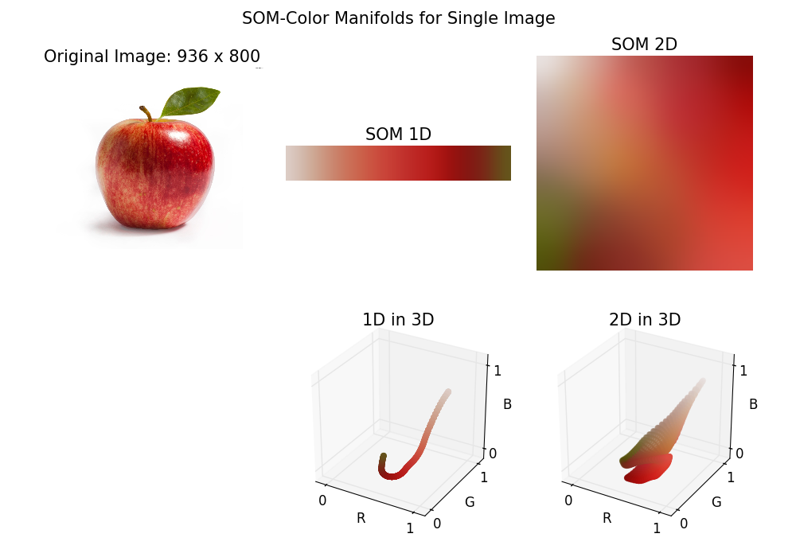
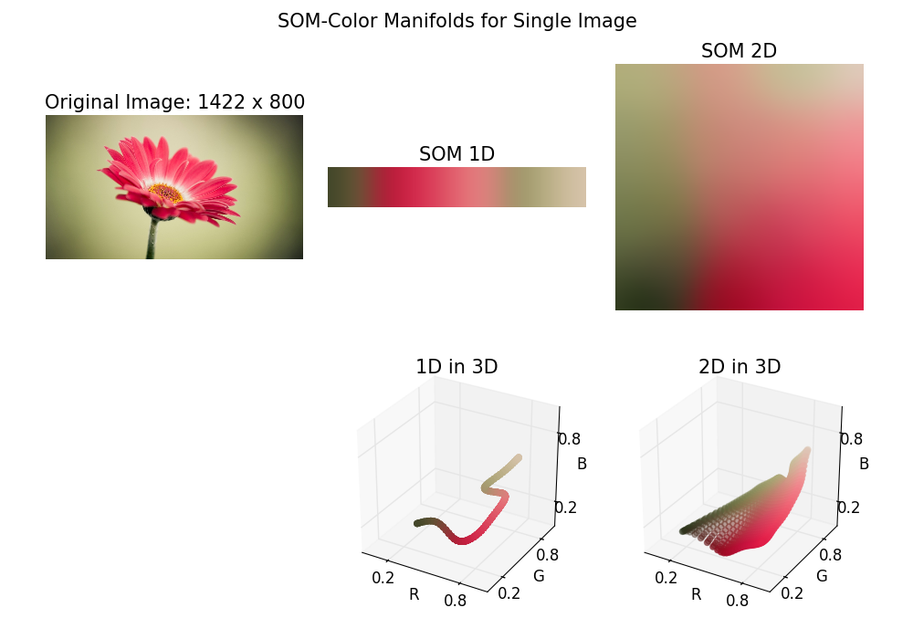
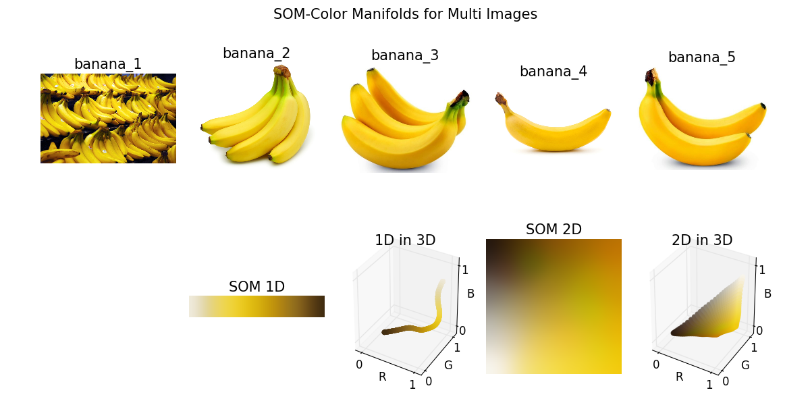
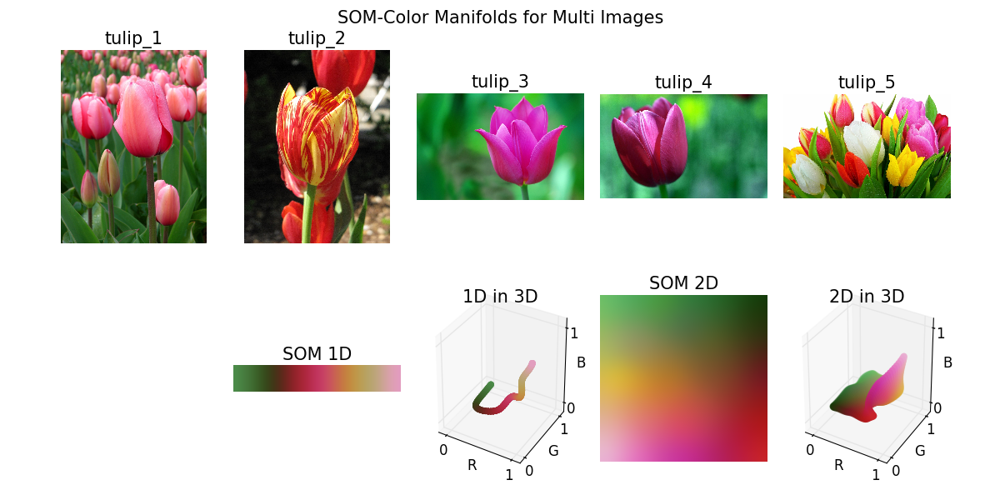
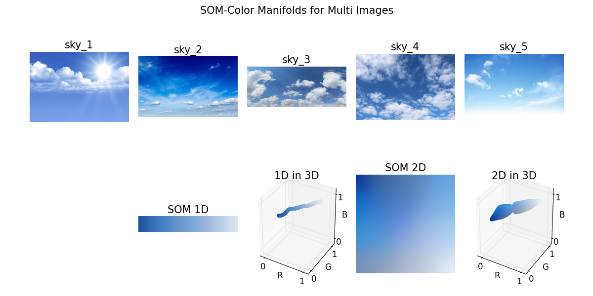

SOM for Color Manifolds (Python)
====

Simple python demos of Data-driven Color Manifolds [Nguyen et al. 2015].

They used Self-Organizing Maps (**SOM**) to construct data-driven **color manifolds**.

Overview of their approach:

1. Color samples from image datasets.
2. Dimensionality reduction via **SOM**.
3. Applications: color editing, palettes, stylization, etc.

In this demo package, I implemented **color sampling part** and **dimensionality reduction part** for observing the color manifolds of image datasets.

* Hist3D class: [```som_cm/core/hist_3d.py```](som_cm/core/hist_3d.py).
    - Color sampling with 3D color histograms.
* SOM class: [```som_cm/core/som.py```](som_cm/core/som.py)
    - **SOM** dimensionality reduction code.

## Examples

### SOM-Color Manifolds for Single Image:

In the following demo, I plotted 1D and 2D color manifolds by changing the ```SOMParam```.




#### Example code:

``` python
import numpy as np
import matplotlib.pyplot as plt
from mpl_toolkits.mplot3d import Axes3D

from som_cm.io_util.image import loadRGB
from som_cm.core.hist_3d import Hist3D
from som_cm.core.som import SOMParam, SOM, SOMPlot

# Load image.
image = loadRGB(image_file)

# Color samples from 3D color histograms.
hist3D = Hist3D(image, num_bins=16)
color_samples = hist3D.colorCoordinates()

# Generate random data samples from color samples.
random_seed=100
num_samples=1000
random_ids = np.random.randint(len(color_samples) - 1, size=num_samples)
samples = color_samples[random_ids]

# 2D SOM: 32 x 32 map size.
param2D = SOMParam(h=32, dimension=2)
som2D = SOM(samples, param2D)

# Compute training process.
som2D.trainAll()

# SOM plotter.
som2D_plot = SOMPlot(som2D)

fig = plt.figure()

# Plot image.
fig.add_subplot(131)
plt.imshow(image)
plt.axis('off')

# Plot 2D SOM.
fig.add_subplot(132)
som2D_plot.updateImage()
plt.axis('off')

# Plot 2D SOM result in 3D RGB color space.
ax = fig.add_subplot(133, projection='3d')
som2D_plot.plot3D(ax)

plt.show()

```
Complete example code is available: [```som_cm/results/single_image.py```](som_cm/results/single_image.py)

### Animation demo for Single Image:

Complete example code is available: [```som_cm/results/animation.py```](som_cm/results/animation.py)

### SOM-Color Manifolds for Multi-Images:

In the following demo, I plotted 1D and 2D color manifolds for multi-images.





Complete example code is available: [```som_cm/results/multi_images.py```](som_cm/results/multi_images.py)

## Installation

*Note*: This program was only tested on **Windows** with **Python2.7**.
**Linux** and **Mac OS** are not officially supported,
but the following instructions might be helpful for installing on those environments.

### Dependencies
Please install the following required python modules.

* **NumPy**
* **SciPy**
* **matplotlib**
* **OpenCV**

As these modules are heavily dependent on NumPy modules, please install appropriate packages for your development environment (Python versions, 32-bit or 64-bit).
For 64-bit Windows, you can download the binaries from [**Unofficial Windows Binaries for Python Extension Packages**](http://www.lfd.uci.edu/~gohlke/pythonlibs/).

<!-- This program also uses **docopt** for CLI.
**docopt** will be installed automatically through the following **pip** command for main modules. -->

### Install main modules

You can use **pip** command for installing main modules.
Please run the following command from the shell.

``` bash
  > pip install git+https://github.com/tody411/SOM-ColorManifolds.git
```

## Usage
### Run SOM Demo

* [```som_cm/main.py```](som_cm/main.py):

You can test the SOM demo with the following command from ```som_cm``` directory.
``` bash
  > python main.py
```

This command will start downloading test images via Google Image API then run the demo module to generate result images.

### Examples Codes
* [```som_cm/results```](som_cm/results): You can find example codes to generate result images.

<!-- ## API Document

API document will be managed by [doxygen](http://www.stack.nl/~dimitri/doxygen/) framework.
Online version is provided in the following link:
* [**inversetoon API Document**](http://tody411.github.io/InverseToon/index.html) (html)

For a local copy, please use the following doxygen command from *doxygen* directory.
``` bash
  > doxygen doxygen_config
``` -->

<!-- ## Future tasks

* [ ] Implement background removal. -->

## License

The MIT License 2015 (c) tody